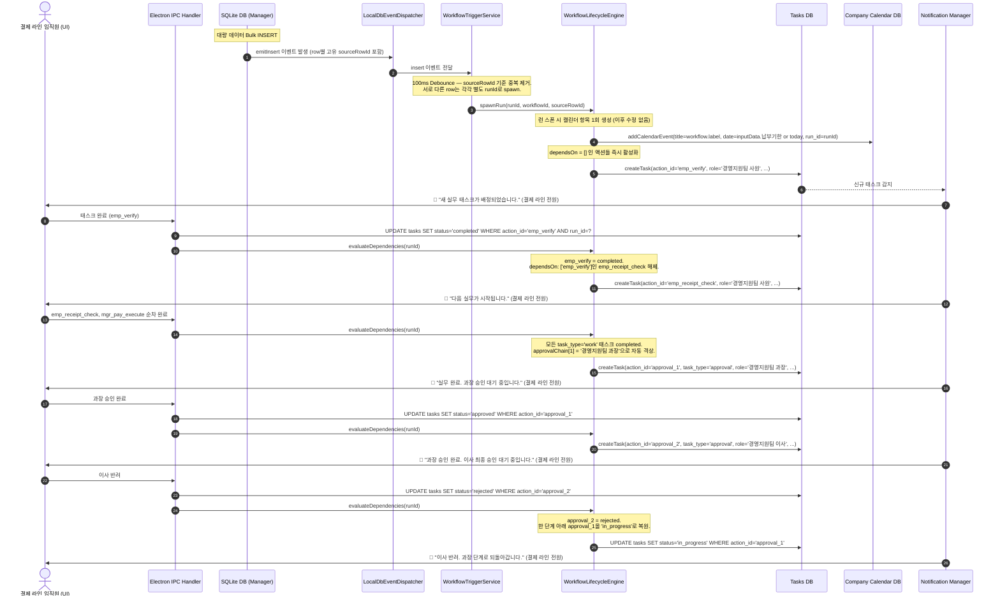

# EGDesk 이벤트 감지 및 워크플로 실행 라이프사이클 (Workflow Runtime Lifecycle) 아키텍처 설계

기존 EGDesk의 AI Center, 워크플로 명세 및 런타임 저장소(`WorkflowDbManager`), 그리고 내장 MCP 도구들을 긴밀히 연결하기 위한 **이벤트 감지 및 워크플로 실행 엔진(Event Detection & Workflow Execution Engine)**의 최종 아키텍처 설계서입니다.

---

## 핵심 도메인 이중 분리 원칙

**Company Calendar (회사 캘린더)** — 전사 공유 비즈니스 마일스톤과 데드라인을 시각화하는 인간용 뷰. 워크플로 런 스폰 시 1회 생성되며 이후 엔진이 수정하지 않습니다. 엔진은 캘린더를 읽지 않으며, 캘린더는 상태(status)를 갖지 않습니다.

**Tasks (태스크)** — 실무자가 오늘 처리해야 할 물리적 업무 이력. 엔진이 읽고 쓰는 유일한 실행 데이터. `dependsOn` 해소, 승인 체인 격상, 반려 롤백 — 모든 엔진 로직은 오직 `tasks` 테이블을 기준으로 작동합니다.

워크플로 실행 순서는 `stages` 없이 **`dependsOn` DAG만으로 완전히 표현**됩니다. 승인 격상 타이밍은 해당 런의 모든 실무 태스크(`task_type='work'`)가 `completed`가 되는 시점입니다.

---

## 1. 런타임 라이프사이클 (End-to-End Sequence)



---

## 2. 전체 데이터베이스 스키마

EGDesk 워크플로 엔진은 세 개의 논리적 DB 파일로 구성됩니다. 각 파일의 역할과 테이블 전체 스키마를 아래에 명시합니다.

```
egdesk/
├── workflow.db     — 워크플로 명세 + 런 기록 (엔진의 두뇌)
├── userdata.db     — 태스크 + 캘린더 + 사용자 테이블 데이터 (엔진의 실행 상태)
└── neuron.db       — AI Center DB (알림 로그 포함)
└── conversations.db — 대화 이력 (UI 레이어)
```

---

### 2.1. workflow.db (Note: Currently merged into neuron.db in implementation)

#### workflows 테이블 — 워크플로 명세 저장소

AI가 MCP로 배포한 워크플로 명세를 JSON으로 저장합니다. 엔진은 런 스폰 시 이 테이블에서 명세를 읽어 `actions`, `approvalChain`을 파싱합니다.

```sql
CREATE TABLE IF NOT EXISTS workflows (
    id           TEXT PRIMARY KEY,           -- uuid
    name         TEXT NOT NULL UNIQUE,       -- triggerTable 매핑 키
    label        TEXT NOT NULL,              -- 사람이 읽는 워크플로 이름 (캘린더 title에 사용)
    spec         TEXT NOT NULL,              -- 전체 워크플로 명세 JSON (actions, approvalChain 포함)
    trigger_table TEXT NOT NULL,             -- 이 테이블에 INSERT 발생 시 트리거
    created_at   DATETIME DEFAULT CURRENT_TIMESTAMP,
    updated_at   DATETIME DEFAULT CURRENT_TIMESTAMP
);

CREATE INDEX IF NOT EXISTS idx_workflows_trigger ON workflows(trigger_table);
```

#### runs 테이블 — 워크플로 런 기록

워크플로가 실제로 기동된 각 인스턴스. 하나의 워크플로 명세에서 여러 런이 생성됩니다.

```sql
CREATE TABLE IF NOT EXISTS runs (
    id            TEXT PRIMARY KEY,          -- uuid (runId)
    workflow_id   TEXT NOT NULL,             -- workflows.id 참조
    status        TEXT NOT NULL DEFAULT 'active',
                                             -- 'active' | 'completed' | 'cancelled'
    input_data    TEXT NOT NULL,             -- 트리거 당시의 row 데이터 JSON
    source_table  TEXT NOT NULL,             -- 트리거된 사용자 테이블명
    source_row_id TEXT NOT NULL,             -- 트리거된 원본 row의 id
    created_at    DATETIME DEFAULT CURRENT_TIMESTAMP,
    updated_at    DATETIME DEFAULT CURRENT_TIMESTAMP,
    FOREIGN KEY (workflow_id) REFERENCES workflows(id)
);

CREATE INDEX IF NOT EXISTS idx_runs_workflow_id   ON runs(workflow_id);
CREATE INDEX IF NOT EXISTS idx_runs_status        ON runs(status);
CREATE INDEX IF NOT EXISTS idx_runs_source_row_id ON runs(source_row_id);
```

**설계 원칙:**
- `input_data`는 트리거 시점의 row 스냅샷입니다. 원본 테이블 데이터가 이후 변경되어도 런은 트리거 당시 값을 기준으로 동작합니다.
- `source_row_id` 인덱스는 디바운스 레이어에서 중복 런 스폰 방지에 사용됩니다.
- `status`는 엔진이 직접 관리합니다. UI가 직접 수정하지 않습니다.

---

### 2.2. userdata.db

#### tasks 테이블 — 엔진 실행의 단일 진실 공급원

```sql
CREATE TABLE IF NOT EXISTS tasks (
    id          TEXT PRIMARY KEY,
    action_id   TEXT NOT NULL,               -- 워크플로 명세의 action.id와 1:1 매핑
    run_id      TEXT NOT NULL,               -- runs.id 참조
    title       TEXT NOT NULL,
    role        TEXT NOT NULL,               -- 담당 역할
    task_type   TEXT NOT NULL DEFAULT 'work', -- 'work' | 'approval'
    status      TEXT NOT NULL DEFAULT 'pending',
                                             -- 'pending' | 'in_progress' | 'completed'
                                             -- | 'approved' | 'rejected' | 'cancelled'
    created_at  DATETIME DEFAULT CURRENT_TIMESTAMP,
    updated_at  DATETIME DEFAULT CURRENT_TIMESTAMP
);

CREATE INDEX IF NOT EXISTS idx_tasks_run_id    ON tasks(run_id);
CREATE INDEX IF NOT EXISTS idx_tasks_action_id ON tasks(action_id, run_id);
CREATE INDEX IF NOT EXISTS idx_tasks_role      ON tasks(role);
CREATE INDEX IF NOT EXISTS idx_tasks_status    ON tasks(status);
```

#### company_calendar 테이블 — 인간용 데드라인 뷰

```sql
CREATE TABLE IF NOT EXISTS company_calendar (
    id          TEXT PRIMARY KEY,
    title       TEXT NOT NULL,               -- workflow.label 사용
    description TEXT,
    date        TEXT NOT NULL,               -- inputData에서 추출한 마감일 또는 CURRENT_DATE
    run_id      TEXT,                        -- 참고용. 엔진 로직에 사용 안 함.
    created_at  DATETIME DEFAULT CURRENT_TIMESTAMP
);

CREATE INDEX IF NOT EXISTS idx_cal_date   ON company_calendar(date);
CREATE INDEX IF NOT EXISTS idx_cal_run_id ON company_calendar(run_id);
```

#### user_tables 메타 테이블 — 사용자 정의 테이블 레지스트리

사용자가 EGDesk에서 생성한 커스텀 비즈니스 테이블의 메타데이터를 관리합니다. `LocalDbEventDispatcher`가 감시할 테이블 목록을 이 테이블에서 조회합니다.

```sql
CREATE TABLE IF NOT EXISTS user_tables (
    id           TEXT PRIMARY KEY,
    name         TEXT NOT NULL UNIQUE,       -- 실제 SQLite 테이블명 (trigger_table 매핑 키)
    label        TEXT NOT NULL,              -- 사람이 읽는 테이블 이름
    schema_json  TEXT NOT NULL,              -- 컬럼 정의 JSON
    created_at   DATETIME DEFAULT CURRENT_TIMESTAMP
);
```

사용자 테이블의 실제 데이터는 `user_tables`에 등록된 `name`을 테이블명으로 하여 `userdata.db` 안에 동적으로 생성됩니다. 예: `name = '법인차량 과태료'`이면 `userdata.db`에 `법인차량 과태료` 테이블이 존재합니다.

---

### 2.3. conversations.db

#### activity_logs 테이블 — 알림 및 활동 로그

```sql
CREATE TABLE IF NOT EXISTS activity_logs (
    id             TEXT PRIMARY KEY,
    recipient_role TEXT NOT NULL,            -- 수신 역할
    title          TEXT NOT NULL,
    body           TEXT NOT NULL,
    run_id         TEXT,                     -- 관련 런 (참고용)
    is_read        INTEGER NOT NULL DEFAULT 0, -- 0 = 미확인, 1 = 확인
    created_at     DATETIME DEFAULT CURRENT_TIMESTAMP
);

CREATE INDEX IF NOT EXISTS idx_logs_recipient ON activity_logs(recipient_role);
CREATE INDEX IF NOT EXISTS idx_logs_run_id    ON activity_logs(run_id);
CREATE INDEX IF NOT EXISTS idx_logs_is_read   ON activity_logs(recipient_role, is_read);
```

---

## 3. SQLite 이벤트 디스패치 시스템 (Event Dispatch System)

SQLite는 네이티브 변경 감지 이벤트를 외부로 노출하지 않습니다. EGDesk는 **SQLite update_hook + Electron IPC**를 조합하여 메인 프로세스 안에서 완전한 이벤트 파이프라인을 구성합니다.

### 3.1. 전체 파이프라인 구조

```
[사용자 테이블 INSERT]
        │
        ▼
 SQLiteManager.write()          — 유일한 DB 쓰기 진입점
        │
        ▼
 update_hook 콜백 (main process) — better-sqlite3가 동기적으로 호출
        │
        ▼
 LocalDbEventDispatcher         — Node.js EventEmitter 기반 내부 이벤트 버스
        │
        ▼
 WorkflowTriggerService         — 100ms 디바운스 + sourceRowId 중복 제거
        │
        ▼
 WorkflowLifecycleEngine        — spawnRun() → evaluateDependencies()
        │
        ▼
 NotificationManager            — activity_logs INSERT + IPC push to renderer
        │
        ▼
 Renderer Process (UI)          — ipcRenderer.on('notification:push', ...)
```

### 3.2. SQLiteManager — 단일 DB 쓰기 진입점

모든 DB 쓰기는 반드시 `SQLiteManager`를 통해야 합니다. `update_hook`은 `better-sqlite3`의 `db.function` / 직접 `db.exec` 경로에서는 발화하지 않으므로, 쓰기 경로를 단일화하여 훅 누락을 원천 차단합니다.

```typescript
// src/main/sqlite/manager.ts
import Database from 'better-sqlite3';
import { LocalDbEventDispatcher } from '../events/local-db-event-dispatcher';

export class SQLiteManager {
  private static instance: SQLiteManager;
  private userDataDb: Database.Database;
  private workflowDb: Database.Database;
  private conversationsDb: Database.Database;

  private constructor() {
    this.userDataDb    = new Database('userdata.db');
    this.workflowDb    = new Database('workflow.db');
    this.conversationsDb = new Database('conversations.db');

    this.applyPragmas(this.userDataDb);
    this.applyPragmas(this.workflowDb);
    this.registerUpdateHook();
  }

  public static getInstance(): SQLiteManager {
    if (!SQLiteManager.instance) {
      SQLiteManager.instance = new SQLiteManager();
    }
    return SQLiteManager.instance;
  }

  private applyPragmas(db: Database.Database): void {
    // WAL 모드: 읽기와 쓰기를 동시에 허용. 워크플로 엔진의 읽기/쓰기 혼재 환경에 필수.
    db.pragma('journal_mode = WAL');
    // 외래키 제약 활성화
    db.pragma('foreign_keys = ON');
  }

  /**
   * update_hook 등록 — userdata.db의 INSERT/UPDATE/DELETE를 감시.
   * better-sqlite3의 update_hook은 동기적으로 호출되며 메인 스레드에서 실행됩니다.
   *
   * 콜백 파라미터:
   *   type      — 'insert' | 'update' | 'delete'
   *   database  — 항상 'main' (attached DB는 별도 처리 필요)
   *   tableName — 변경된 테이블명
   *   rowid     — 변경된 row의 SQLite internal rowid
   */
  private registerUpdateHook(): void {
    this.userDataDb.updateHook((type, database, tableName, rowid) => {
      if (type !== 'insert') return; // 워크플로 트리거는 INSERT만 감지

      const dispatcher = LocalDbEventDispatcher.getInstance();
      dispatcher.emitInsert(tableName, rowid);
    });
  }

  public getUserDataDatabase(): Database.Database { return this.userDataDb; }
  public getWorkflowDatabase(): Database.Database  { return this.workflowDb; }
  public getConversationsDatabase(): Database.Database { return this.conversationsDb; }
}
```

**주의사항:**
- `update_hook` 콜백 내부에서 동일 DB에 쓰기 작업을 하면 데드락이 발생합니다. 콜백은 이벤트 발행만 하고 즉시 반환해야 합니다. 실제 DB 쓰기는 비동기로 이벤트 핸들러에서 처리합니다.
- `rowid`는 SQLite internal rowid이며 `id` TEXT PRIMARY KEY와 다릅니다. 실제 row 데이터는 `rowid`로 `SELECT`하거나, INSERT 시 반환된 `lastInsertRowid`를 사용합니다.

### 3.3. LocalDbEventDispatcher — 내부 이벤트 버스

`update_hook`의 `rowid`를 받아 실제 row 데이터를 조회하고, 워크플로가 구독 중인 테이블인지 확인한 뒤 이벤트를 발행합니다.

```typescript
// src/main/events/local-db-event-dispatcher.ts
import { EventEmitter } from 'events';
import Database from 'better-sqlite3';

export interface RowInsertEvent {
  tableName: string;
  sourceRowId: string;  // row의 TEXT id (uuid)
  rowData: Record<string, unknown>;
}

export class LocalDbEventDispatcher extends EventEmitter {
  private static instance: LocalDbEventDispatcher;
  private userDataDb!: Database.Database;

  public static getInstance(): LocalDbEventDispatcher {
    if (!LocalDbEventDispatcher.instance) {
      LocalDbEventDispatcher.instance = new LocalDbEventDispatcher();
    }
    return LocalDbEventDispatcher.instance;
  }

  public init(userDataDb: Database.Database): void {
    this.userDataDb = userDataDb;
  }

  /**
   * update_hook에서 호출됨.
   * rowid로 실제 row를 조회하여 RowInsertEvent를 구성하고 발행합니다.
   *
   * 이 메서드는 update_hook 콜백 내에서 호출되므로
   * DB 쓰기를 하지 않습니다 — 읽기(SELECT)만 수행합니다.
   */
  public emitInsert(tableName: string, rowid: number): void {
    try {
      // rowid로 방금 삽입된 row 조회
      const row = this.userDataDb
        .prepare(`SELECT * FROM "${tableName}" WHERE rowid = ?`)
        .get(rowid) as Record<string, unknown> | undefined;

      if (!row) return;

      const sourceRowId = row['id'] as string;
      if (!sourceRowId) return;

      const event: RowInsertEvent = { tableName, sourceRowId, rowData: row };
      this.emit('insert', event);
    } catch {
      // 감시 대상이 아닌 시스템 테이블 INSERT는 조용히 무시
    }
  }
}
```

### 3.4. WorkflowTriggerService — 디바운스 및 런 스폰

`LocalDbEventDispatcher`의 `insert` 이벤트를 구독하고, 해당 테이블에 연결된 워크플로를 찾아 런을 스폰합니다.

```typescript
// src/main/workflow/workflow-trigger-service.ts
import { LocalDbEventDispatcher, RowInsertEvent } from '../events/local-db-event-dispatcher';
import { WorkflowLifecycleEngine } from './workflow-lifecycle-engine';
import { SQLiteManager } from '../sqlite/manager';

export class WorkflowTriggerService {
  private static instance: WorkflowTriggerService;

  // sourceRowId별 마지막 이벤트를 보관. 동일 row의 중복 INSERT 이벤트를 제거.
  private pendingRows = new Map<string, RowInsertEvent>();
  private debounceTimer: ReturnType<typeof setTimeout> | null = null;

  public static getInstance(): WorkflowTriggerService {
    if (!WorkflowTriggerService.instance) {
      WorkflowTriggerService.instance = new WorkflowTriggerService();
    }
    return WorkflowTriggerService.instance;
  }

  public init(): void {
    const dispatcher = LocalDbEventDispatcher.getInstance();
    dispatcher.on('insert', (event: RowInsertEvent) => this.handleInsert(event));
  }

  private handleInsert(event: RowInsertEvent): void {
    // 동일 sourceRowId는 덮어씀 (중복 제거)
    this.pendingRows.set(event.sourceRowId, event);

    if (this.debounceTimer) clearTimeout(this.debounceTimer);
    this.debounceTimer = setTimeout(() => this.flush(), 100);
  }

  private async flush(): Promise<void> {
    const rows = new Map(this.pendingRows);
    this.pendingRows.clear();
    this.debounceTimer = null;

    const workflowDb = SQLiteManager.getInstance().getWorkflowDatabase();
    const engine = WorkflowLifecycleEngine.getInstance();

    for (const [, event] of rows) {
      // 이 테이블을 trigger_table로 갖는 워크플로 조회
      const workflow = workflowDb
        .prepare('SELECT * FROM workflows WHERE trigger_table = ?')
        .get(event.tableName) as { id: string; spec: string; label: string } | undefined;

      if (!workflow) continue;

      // 동일 source_row_id로 이미 active 런이 있으면 중복 스폰 방지
      const existing = workflowDb
        .prepare(`SELECT id FROM runs WHERE source_row_id = ? AND status = 'active'`)
        .get(event.sourceRowId);

      if (existing) continue;

      await engine.spawnRun({
        workflowId: workflow.id,
        sourceRowId: event.sourceRowId,
        sourceTable: event.tableName,
        inputData: event.rowData,
      });
    }
  }
}
```

### 3.5. WorkflowLifecycleEngine — 런 스폰 및 의존성 평가

```typescript
// src/main/workflow/workflow-lifecycle-engine.ts
import { SQLiteManager } from '../sqlite/manager';
import { NotificationManager } from '../notification/notification-manager';
import crypto from 'crypto';

interface SpawnRunParams {
  workflowId: string;
  sourceRowId: string;
  sourceTable: string;
  inputData: Record<string, unknown>;
}

export class WorkflowLifecycleEngine {
  private static instance: WorkflowLifecycleEngine;
  public static getInstance(): WorkflowLifecycleEngine {
    if (!WorkflowLifecycleEngine.instance) {
      WorkflowLifecycleEngine.instance = new WorkflowLifecycleEngine();
    }
    return WorkflowLifecycleEngine.instance;
  }

  /**
   * 신규 워크플로 런을 생성하고 초기 태스크를 활성화합니다.
   * 캘린더 항목도 이 시점에 단 1회 생성됩니다.
   */
  public async spawnRun(params: SpawnRunParams): Promise<void> {
    const { workflowId, sourceRowId, sourceTable, inputData } = params;
    const db = SQLiteManager.getInstance();
    const workflowDb = db.getWorkflowDatabase();
    const userDataDb = db.getUserDataDatabase();

    const workflow = workflowDb
      .prepare('SELECT * FROM workflows WHERE id = ?')
      .get(workflowId) as { id: string; label: string; spec: string } | undefined;

    if (!workflow) return;

    const spec = JSON.parse(workflow.spec);
    const runId = crypto.randomUUID();

    // 1. runs 테이블에 런 기록 생성
    workflowDb.prepare(`
      INSERT INTO runs (id, workflow_id, status, input_data, source_table, source_row_id)
      VALUES (?, ?, 'active', ?, ?, ?)
    `).run(runId, workflowId, JSON.stringify(inputData), sourceTable, sourceRowId);

    // 2. 캘린더 항목 1회 생성 (이후 엔진이 수정하지 않음)
    const calDate = this.extractDate(inputData, spec.inputs) ?? new Date().toISOString().slice(0, 10);
    userDataDb.prepare(`
      INSERT INTO company_calendar (id, title, date, run_id)
      VALUES (?, ?, ?, ?)
    `).run(crypto.randomUUID(), workflow.label, calDate, runId);

    // 3. dependsOn = [] 인 액션 즉시 활성화
    await this.evaluateDependencies(runId);
  }

  /**
   * 태스크 상태 변이 후 호출. DAG 해소 + 승인 격상 + 반려 롤백을 모두 처리합니다.
   */
  public async evaluateDependencies(runId: string): Promise<void> {
    const db = SQLiteManager.getInstance();
    const workflowDb = db.getWorkflowDatabase();
    const userDataDb = db.getUserDataDatabase();

    const run = workflowDb
      .prepare('SELECT * FROM runs WHERE id = ?')
      .get(runId) as { workflow_id: string; input_data: string } | undefined;

    if (!run) return;

    const workflow = workflowDb
      .prepare('SELECT * FROM workflows WHERE id = ?')
      .get(run.workflow_id) as { spec: string } | undefined;

    if (!workflow) return;

    const spec = JSON.parse(workflow.spec);
    const actions: any[] = spec.actions ?? [];
    const approvalChain: string[] = spec.approvalChain ?? [];

    // 현재 tasks 상태 조회
    const existingTasks = userDataDb
      .prepare('SELECT action_id, status, task_type FROM tasks WHERE run_id = ?')
      .all(runId) as { action_id: string; status: string; task_type: string }[];

    const existingIds = new Set(existingTasks.map(t => t.action_id));
    const completedIds = new Set(
      existingTasks.filter(t => t.status === 'completed').map(t => t.action_id)
    );

    // ── 1. 실무 DAG 해소 ──────────────────────────────────────────
    for (const action of actions) {
      if (action.type !== 'create_task') continue;
      if (existingIds.has(action.id)) continue; // 이미 생성된 태스크

      const deps: string[] = action.dependsOn ?? [];
      const allDepsMet = deps.every(dep => completedIds.has(dep));
      if (!allDepsMet) continue;

      const taskId = crypto.randomUUID();
      userDataDb.prepare(`
        INSERT INTO tasks (id, action_id, run_id, title, role, task_type, status)
        VALUES (?, ?, ?, ?, ?, 'work', 'pending')
      `).run(taskId, action.id, runId, action.title, action.role);

      await NotificationManager.getInstance().handleTaskEvent(
        taskId, `새 태스크가 배정되었습니다: ${action.title}`
      );
    }

    // ── 2. 승인 격상 조건 확인 ────────────────────────────────────
    const workTasks = existingTasks.filter(t => t.task_type === 'work');
    const allWorkDone = workTasks.length > 0 && workTasks.every(t => t.status === 'completed');
    if (!allWorkDone) return;

    // ── 3. 현재 승인 위치 추론 ────────────────────────────────────
    const approvalTasks = existingTasks
      .filter(t => t.task_type === 'approval')
      .sort((a, b) => {
        const idxA = parseInt(a.action_id.replace('approval_', ''), 10);
        const idxB = parseInt(b.action_id.replace('approval_', ''), 10);
        return idxA - idxB;
      });

    // 반려 감지
    const rejectedTask = approvalTasks.find(t => t.status === 'rejected');
    if (rejectedTask) {
      await this.handleRejection(runId, rejectedTask.action_id, approvalTasks, workTasks);
      return;
    }

    // 최상단 완료 확인
    const maxApprovalIndex = approvalChain.length - 1; // approvalChain[0]은 기안자 (실무자)
    const lastApproval = approvalTasks[approvalTasks.length - 1];
    if (lastApproval?.status === 'approved') {
      const approvedIndex = parseInt(lastApproval.action_id.replace('approval_', ''), 10);
      if (approvedIndex >= maxApprovalIndex) {
        // 최종 완료
        workflowDb.prepare(`UPDATE runs SET status = 'completed' WHERE id = ?`).run(runId);
        await NotificationManager.getInstance().handleTaskEvent(
          lastApproval.action_id, '워크플로가 최종 완료되었습니다.'
        );
        return;
      }
    }

    // 다음 승인 태스크 생성
    const approvedCount = approvalTasks.filter(t => t.status === 'approved').length;
    const nextApprovalIndex = approvedCount + 1; // index 0은 기안자이므로 1부터 격상 시작
    const nextApprovalActionId = `approval_${nextApprovalIndex}`;

    if (existingIds.has(nextApprovalActionId)) return; // 이미 생성됨

    const nextRole = approvalChain[nextApprovalIndex];
    if (!nextRole) return;

    const taskId = crypto.randomUUID();
    userDataDb.prepare(`
      INSERT INTO tasks (id, action_id, run_id, title, role, task_type, status)
      VALUES (?, ?, ?, '승인 대기', ?, 'approval', 'pending')
    `).run(taskId, nextApprovalActionId, runId, nextRole);

    await NotificationManager.getInstance().handleTaskEvent(
      taskId, `${nextRole} 승인이 요청되었습니다.`
    );
  }

  /**
   * 반려 처리 — 항상 한 단계 아래로만 롤백합니다.
   */
  private async handleRejection(
    runId: string,
    rejectedActionId: string,
    approvalTasks: { action_id: string; status: string }[],
    workTasks: { action_id: string; status: string }[]
  ): Promise<void> {
    const userDataDb = SQLiteManager.getInstance().getUserDataDatabase();
    const rejectedIndex = parseInt(rejectedActionId.replace('approval_', ''), 10);
    const rollbackIndex = rejectedIndex - 1;

    if (rollbackIndex >= 1) {
      // 한 단계 위 결재자에게 롤백
      const rollbackActionId = `approval_${rollbackIndex}`;
      userDataDb.prepare(`
        UPDATE tasks SET status = 'in_progress', updated_at = datetime('now')
        WHERE action_id = ? AND run_id = ?
      `).run(rollbackActionId, runId);

      await NotificationManager.getInstance().handleTaskEvent(
        rollbackActionId, '반려되었습니다. 이전 결재 단계로 되돌아갑니다.'
      );
    } else {
      // rollbackIndex = 0: 기안자 실무 단계로 복원
      // 실무 태스크 중 마지막으로 completed된 것들을 in_progress로 되돌림
      for (const task of workTasks) {
        if (task.status === 'completed') {
          userDataDb.prepare(`
            UPDATE tasks SET status = 'in_progress', updated_at = datetime('now')
            WHERE action_id = ? AND run_id = ?
          `).run(task.action_id, runId);
        }
      }

      await NotificationManager.getInstance().handleTaskEvent(
        rejectedActionId, '반려되었습니다. 기안 실무자에게 되돌아갑니다.'
      );
      // 이 상태에서 탈출 경로 없음. 시스템 관리자의 런 삭제로만 종료.
    }
  }

  /**
   * inputData에서 마감일 필드를 추출합니다.
   * workflow.inputs 배열에서 '기한', '마감', 'deadline', 'due' 키워드를 포함한 필드를 탐색합니다.
   */
  private extractDate(
    inputData: Record<string, unknown>,
    inputs: string[]
  ): string | null {
    const deadlineKeywords = ['기한', '마감', 'deadline', 'due', '납부기한', '만료'];
    for (const key of inputs) {
      if (deadlineKeywords.some(kw => key.includes(kw))) {
        const val = inputData[key];
        if (typeof val === 'string' && val.match(/^\d{4}-\d{2}-\d{2}/)) return val;
      }
    }
    return null;
  }
}
```

### 3.6. Electron IPC 핸들러 — Renderer와의 연결

Renderer 프로세스(UI)가 태스크 완료/승인/반려를 처리하는 IPC 채널입니다. 모든 DB 쓰기와 엔진 호출은 메인 프로세스에서만 이루어집니다.

```typescript
// src/main/ipc/task-handlers.ts
import { ipcMain } from 'electron';
import { SQLiteManager } from '../sqlite/manager';
import { WorkflowLifecycleEngine } from '../workflow/workflow-lifecycle-engine';

export function registerTaskIpcHandlers(): void {

  /**
   * 실무 태스크 완료
   * Renderer: ipcRenderer.invoke('task:complete', { taskId, runId })
   */
  ipcMain.handle('task:complete', async (_, { taskId, runId }: { taskId: string; runId: string }) => {
    const db = SQLiteManager.getInstance().getUserDataDatabase();
    db.prepare(`
      UPDATE tasks SET status = 'completed', updated_at = datetime('now') WHERE id = ?
    `).run(taskId);

    await WorkflowLifecycleEngine.getInstance().evaluateDependencies(runId);
    return { ok: true };
  });

  /**
   * 승인 태스크 승인
   * Renderer: ipcRenderer.invoke('task:approve', { taskId, runId })
   */
  ipcMain.handle('task:approve', async (_, { taskId, runId }: { taskId: string; runId: string }) => {
    const db = SQLiteManager.getInstance().getUserDataDatabase();
    db.prepare(`
      UPDATE tasks SET status = 'approved', updated_at = datetime('now') WHERE id = ?
    `).run(taskId);

    await WorkflowLifecycleEngine.getInstance().evaluateDependencies(runId);
    return { ok: true };
  });

  /**
   * 승인 태스크 반려
   * Renderer: ipcRenderer.invoke('task:reject', { taskId, runId })
   */
  ipcMain.handle('task:reject', async (_, { taskId, runId }: { taskId: string; runId: string }) => {
    const db = SQLiteManager.getInstance().getUserDataDatabase();
    db.prepare(`
      UPDATE tasks SET status = 'rejected', updated_at = datetime('now') WHERE id = ?
    `).run(taskId);

    await WorkflowLifecycleEngine.getInstance().evaluateDependencies(runId);
    return { ok: true };
  });

  /**
   * 시스템 관리자 전용: 런 강제 삭제
   * Renderer: ipcRenderer.invoke('run:delete', { runId })
   */
  ipcMain.handle('run:delete', async (_, { runId }: { runId: string }) => {
    const dbManager = SQLiteManager.getInstance();
    const workflowDb = dbManager.getWorkflowDatabase();
    const userDataDb = dbManager.getUserDataDatabase();

    // 관련 태스크 전체 cancelled 처리
    userDataDb.prepare(`
      UPDATE tasks SET status = 'cancelled', updated_at = datetime('now') WHERE run_id = ?
    `).run(runId);

    // 런 cancelled 처리
    workflowDb.prepare(`
      UPDATE runs SET status = 'cancelled', updated_at = datetime('now') WHERE id = ?
    `).run(runId);

    // 결제 라인 전원에게 취소 알림 (NotificationManager가 run_id로 수신자 산출)
    // NotificationManager.getInstance().broadcastCancellation(runId);

    return { ok: true };
  });
}
```

```typescript
// src/main/index.ts (앱 진입점에서 초기화 순서)
import { app } from 'electron';
import { SQLiteManager } from './sqlite/manager';
import { LocalDbEventDispatcher } from './events/local-db-event-dispatcher';
import { WorkflowTriggerService } from './workflow/workflow-trigger-service';
import { registerTaskIpcHandlers } from './ipc/task-handlers';

app.whenReady().then(() => {
  const dbManager = SQLiteManager.getInstance();           // 1. DB 연결 + update_hook 등록
  LocalDbEventDispatcher.getInstance()
    .init(dbManager.getUserDataDatabase());                // 2. 디스패처 초기화
  WorkflowTriggerService.getInstance().init();             // 3. 트리거 서비스 구독 시작
  registerTaskIpcHandlers();                               // 4. IPC 핸들러 등록
});
```

**초기화 순서가 중요합니다.** `SQLiteManager` → `LocalDbEventDispatcher` → `WorkflowTriggerService` 순서를 반드시 지켜야 합니다. `update_hook`은 DB 연결 시점에 등록되므로 디스패처가 준비되기 전에 INSERT가 발생하면 이벤트가 유실됩니다. 앱 준비 전 DB에 쓰지 않도록 주의합니다.

---

## 4. evaluateDependencies 엔진 로직 요약

```
evaluateDependencies(runId):

  1. [실무 DAG 해소]
     tasks에서 runId의 completed action_id 수집.
     actions[]를 순회하여 미생성 + 모든 dependsOn completed인 액션 → createTask().

  2. [승인 격상 조건 확인]
     task_type='work' 전원 completed인지 확인. 아니면 종료.

  3. [현재 승인 위치 추론]
     approval_ 태스크의 상태로 현재 위치 판별.
     rejected 감지 → handleRejection().
     최상단 approved → 런 completed.
     미생성 → 다음 approval_ 태스크 생성.

  4. [반려 롤백]
     rejected approval_K → approval_(K-1) in_progress 복원.
     K-1 = 0이면 실무 태스크들도 in_progress 복원.
     탈출 경로 없음. 시스템 관리자 런 삭제로만 종료.

  5. [최종 완료]
     최상단 승인 태스크 approved → runs.status = 'completed'.
```

---

## 5. 승인 체인 동작 규칙

### 5.1. 현재 승인 위치 추론

```
approvalChain = ["경영지원팀 사원", "경영지원팀 과장", "경영지원팀 이사"]
                  index 0 (기안자)    index 1              index 2

판별 규칙:
- approved 승인 태스크 없음          → 실무 진행 중 (격상 전)
- approval_1 = approved              → 현재 이사(index 2) 단계
- approval_1 = approved,
  approval_2 = rejected              → 과장(index 1)으로 롤백
```

### 5.2. 반려 시 한 단계 롤백

```
approval_2(이사) rejected  → approval_1(과장) in_progress로 복원
approval_1(과장) rejected  → 실무 태스크들 in_progress로 복원
```

`approvalChain[0]` 단계 반려 루프는 엔진이 스스로 종료하지 않습니다. 시스템 관리자의 `run:delete` IPC 호출로만 해소됩니다.

### 5.3. 최종 완료 및 전체 취소

- **최종 완료**: 최상단 승인 태스크 `approved` → `runs.status = 'completed'`.
- **전체 취소**: 시스템 관리자 `run:delete` → 모든 관련 태스크 `cancelled` → `runs.status = 'cancelled'`. 결제 라인 전원 취소 푸시.

---

## 6. 디바운스 및 멀티-런 스폰 규칙

`WorkflowTriggerService`는 `sourceRowId` 단위로 중복을 제거합니다. 동일 row의 중복 INSERT 이벤트는 하나로 병합되며, 서로 다른 row는 각각 독립 런으로 스폰됩니다. `runs` 테이블의 `source_row_id` 인덱스를 통해 `active` 런 중복 생성도 방지합니다.

---

## 7. 알림 설계

알림 트리거는 태스크 상태 변이입니다. 캘린더 INSERT는 알림을 발생시키지 않습니다.

```
수신자 = Set(actions[].role) ∪ Set(approvalChain)
```

알림은 `activity_logs`에 기록되고 `notification:push` IPC 채널로 Renderer에 실시간 전달됩니다.

---

## 8. 워크플로 명세 (Workflow Schema)

### 8.1. 최상위 구조

```json
{
  "inputs": ["field1", "field2"],
  "triggerTable": "테이블이름",
  "approvalChain": ["roleA", "roleB", "roleC"],
  "actions": [...]
}
```

### 8.2. 액션 타입

`create_task`:
```json
{
  "id": "emp_verify",
  "type": "create_task",
  "title": "운행기록 대조 및 실사용자 확인",
  "role": "경영지원팀 사원",
  "dependsOn": []
}
```

`update_status`:
```json
{ "type": "update_status", "value": "정상진행중" }
```
워크플로 런의 status를 갱신합니다. 태스크를 생성하지 않으며 DAG 완료 조건 판별에 포함되지 않습니다.

### 8.3. 런타임 참조 모델

```json
{
  "workflowId": "...",
  "inputData": { "차량번호": "12가3456", "과태료_금액": 80000, "납부기한": "2026-06-30" },
  "sourceTable": "법인차량 과태료",
  "sourceRowId": "row-uuid"
}
```

---

## 9. MCP 배포 예시

```json
{
  "name": "ai_center_create_workflow",
  "args": {
    "inputs": ["차량번호", "위반내용", "과태료_금액", "납부기한"],
    "triggerTable": "법인차량 과태료",
    "approvalChain": ["경영지원팀 사원", "경영지원팀 과장", "경영지원팀 이사"],
    "actions": [
      {
        "id": "emp_verify",
        "type": "create_task",
        "title": "운행기록 대조 및 실사용자 확인",
        "role": "경영지원팀 사원",
        "dependsOn": []
      },
      {
        "id": "emp_receipt_check",
        "type": "create_task",
        "title": "영수증 증빙 확인 및 적격성 대조",
        "role": "경영지원팀 사원",
        "dependsOn": ["emp_verify"]
      },
      {
        "id": "mgr_pay_execute",
        "type": "create_task",
        "title": "과태료 납부 처리 및 송금",
        "role": "경영지원팀 과장",
        "dependsOn": ["emp_receipt_check"]
      },
      {
        "type": "update_status",
        "value": "정상진행중"
      }
    ]
  }
}
```

---

## 10. 결론

`workflows`와 `runs`는 `neuron.db`에서 엔진의 두뇌 역할을 합니다. `tasks`와 `company_calendar`는 `neuron.db`에서 실행 상태와 인간용 뷰를 담당합니다. `activity_logs`는 `neuron.db`에서 알림 이력을 관리합니다. (conversations.db는 순수 대화 이력용으로 분리됨)

이벤트 파이프라인은 `better-sqlite3`의 `update_hook` → `LocalDbEventDispatcher` → `WorkflowTriggerService` → `WorkflowLifecycleEngine` → `NotificationManager` → Electron IPC → Renderer 순서로 단방향 흐름을 유지합니다. `update_hook` 콜백 내부에서는 DB 쓰기를 하지 않으며, 모든 실제 쓰기는 비동기 핸들러에서 처리합니다.

캘린더는 런 스폰 시 1회만 생성되며 이후 엔진이 수정하지 않습니다. `approvalChain[0]` 단계의 반려 루프는 엔진이 스스로 종료하지 않으며 시스템 관리자의 개입으로만 해소됩니다.
