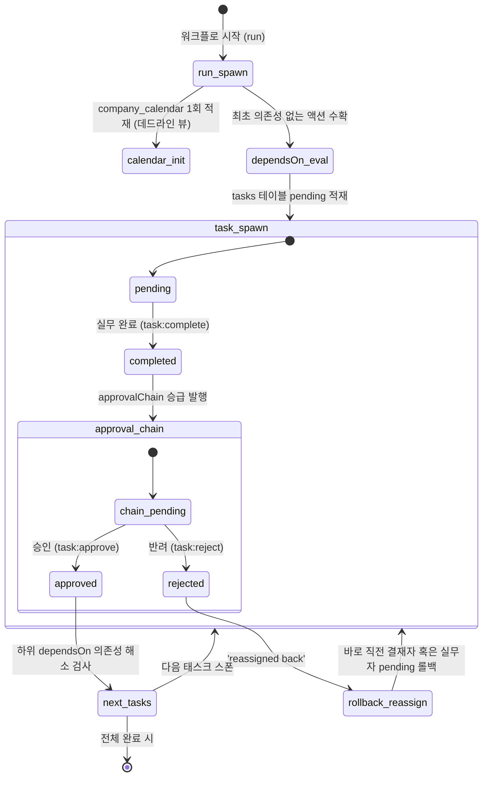

# EGDesk 이벤트 감지 및 워크플로 실행 라이프사이클 (Workflow Runtime Lifecycle) 아키텍처 설계

기존 EGDesk의 AI Center, 워크플로 명세 및 런타임 저장소(`WorkflowDbManager`), 그리고 내장 MCP 도구들을 긴밀히 연결하기 위한 **이벤트 감지 및 워크플로 실행 엔진(Event Detection & Workflow Execution Engine)**의 최종 아키텍처 설계서입니다.

---

## 핵심 도메인 이중 분리 원칙

이 아키텍처는 두 도메인을 철저히 분리합니다.

**Company Calendar (회사 캘린더)** — 전사 공유 비즈니스 마일스톤과 데드라인을 시각화하는 인간용 뷰. 워크플로 런 스폰 시 1회 생성되며 이후 엔진이 수정하지 않습니다. 엔진은 캘린더를 읽지 않으며, 캘린더는 상태(status)를 갖지 않습니다. 4개월 후 마감인 업무도 캘린더에는 해당 날짜에 표시됩니다.

**Tasks (태스크)** — 실무자가 오늘 처리해야 할 물리적 업무 이력. 엔진이 읽고 쓰는 유일한 실행 데이터. `dependsOn` 해소, 승인 체인 격상, 반려 롤백 — 모든 엔진 로직은 오직 `tasks` 테이블 위에서 정밀하게 일어납니다.

---

## 1. 데이터베이스 스키마 레이아웃 (`ai-system.db`)

모든 워크플로 엔진 테이블은 **AI Center Neuron Database (`ai-system.db`)**에 수술적으로 귀속되어 독립 기동합니다.

```sql
-- 1. Workflows 명세
CREATE TABLE IF NOT EXISTS workflows (
  id            TEXT PRIMARY KEY,
  label         TEXT NOT NULL,
  status        TEXT NOT NULL DEFAULT 'draft',
  input_types   TEXT NOT NULL DEFAULT '[]',
  hints         TEXT NOT NULL DEFAULT '[]',
  output_tables TEXT NOT NULL DEFAULT '[]',
  suggested_by  TEXT,
  trigger_table TEXT,
  created_at    TEXT NOT NULL,
  updated_at    TEXT NOT NULL
);

-- 2. Workflows 구성 액션 (stages 없음, 순수 dependsOn 제어)
CREATE TABLE IF NOT EXISTS workflow_actions (
  id          TEXT PRIMARY KEY,
  workflow_id TEXT NOT NULL REFERENCES workflows(id) ON DELETE CASCADE,
  stage       INTEGER NOT NULL DEFAULT 0,
  position    INTEGER NOT NULL,
  action_id   TEXT NOT NULL,
  params      TEXT NOT NULL DEFAULT '{}',
  created_at  TEXT NOT NULL
);

-- 3. 실무 런타임 물리 태스크 (엔진 통제의 단일 진실)
CREATE TABLE IF NOT EXISTS tasks (
  id          TEXT PRIMARY KEY,
  action_id   TEXT NOT NULL,
  run_id      TEXT NOT NULL,
  title       TEXT NOT NULL,
  role        TEXT NOT NULL,
  task_type   TEXT NOT NULL DEFAULT 'work',  -- 'work' | 'approval'
  status      TEXT NOT NULL DEFAULT 'pending', -- 'pending'|'in_progress'|'completed'|'approved'|'rejected'|'cancelled'
  created_at  DATETIME DEFAULT CURRENT_TIMESTAMP,
  updated_at  DATETIME DEFAULT CURRENT_TIMESTAMP
);

CREATE INDEX IF NOT EXISTS idx_tasks_run_id    ON tasks(run_id);
CREATE INDEX IF NOT EXISTS idx_tasks_action_id ON tasks(action_id, run_id);
CREATE INDEX IF NOT EXISTS idx_tasks_role      ON tasks(role);
CREATE INDEX IF NOT EXISTS idx_tasks_status    ON tasks(status);

-- 4. 인간용 비즈니스 데드라인 마일스톤 (상태 없음!)
CREATE TABLE IF NOT EXISTS company_calendar (
  id            TEXT PRIMARY KEY,
  title         TEXT NOT NULL,
  description   TEXT,
  date          TEXT NOT NULL, -- YYYY-MM-DD
  assignee_role TEXT,
  run_id        TEXT,
  created_at    DATETIME DEFAULT CURRENT_TIMESTAMP
);

CREATE INDEX IF NOT EXISTS idx_cal_date       ON company_calendar(date);
CREATE INDEX IF NOT EXISTS idx_cal_assignee   ON company_calendar(assignee_role);

-- 5. 결재 라인 관리
CREATE TABLE IF NOT EXISTS workflow_approvals (
  id             TEXT PRIMARY KEY,
  run_id         TEXT NOT NULL REFERENCES workflow_runs(id) ON DELETE CASCADE,
  stage          INTEGER NOT NULL,
  chain_position INTEGER NOT NULL,
  role           TEXT NOT NULL,
  decision       TEXT CHECK (decision IN ('approved', 'rejected', 'cancelled')),
  decided_at     TEXT,
  created_at     TEXT NOT NULL
);
```

---

## 2. 엔진 라이프사이클 코어 메커니즘 (Engine core mechanisms)



### ① 캘린더 생성 분리
* 캘린더 이벤트는 워크플로가 처음 기동(`run_spawn`)될 때 1회 적재되며, 상태가 없어 엔진이 절대 개입하지 않습니다.

### ② 의존성 해소 스포닝 (Grid Spawning)
* 상위 태스크가 완료(`completed`) 또는 최종 승인(`approved`)되면, 엔진은 해당 런의 하위 `dependsOn` 리스트를 조회하여 상위 조건이 모두 충족된 액션들을 자동으로 찾아내 `tasks` 테이블에 즉각 `pending` 상태로 추가 스폰합니다.

### ③ 승인 에스컬레이션 및 반려 롤백 (Reassigned Back)
* **결재 격상**: 실무 태스크 완료 시, 명세서에 기록된 `approvalChain` 단계가 있다면 해당 결재자들에게 순차적으로 `task_type='approval'` 태스크가 자동으로 생성됩니다.
* **반려 복구**: 결재자가 반려(`rejected`)를 누르는 순간, 엔진은 전체 프로세스를 강제 파괴하는 것이 아니라, 해당 결재 체인의 한 단계 전 결재자 또는 최초 실무 담당자 태스크를 **`pending` 상태로 복원(롤백)**하여 흐름이 살아 움직이도록(Reassign back) 통제합니다.
