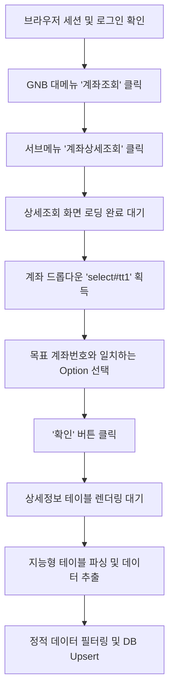

# 📋 IBK 기업은행 계좌상세조회 자동화 및 DB 매핑 구현 계획서

본 계획서는 **IBK 기업은행 기업 인터넷뱅킹**에서 개별 계좌의 상세 정보(예금주명, 예금종류, 신규일자, 계좌관리점 등)를 자동으로 조회·추출하고, 이를 데이터베이스(SQLite)에 안전하고 정합성 높게 매핑하여 저장하는 구현 계획을 정의합니다.

---

## 🎯 1. 설계 원칙 및 목적

1. **정적 메타데이터와 동적 데이터의 격리 (Single Source of Truth)**
   * 계좌잔액(`balance`)이나 평잔 정보 등은 거래 내역 동기화에 의해 지속적으로 계산되는 동적 데이터이므로, **상세조회 스크래핑 대상에서 철저하게 제외**합니다. 
   * 이를 통해 불필요한 데이터 정합성 충돌을 원천 방지하고 정적인 계좌 속성 정보만 깨끗하게 관리합니다.
2. **마이그레이션 프리(Migration-free) 데이터 주입**
   * 기존 `accounts` 테이블의 견고한 구조(`metadata` JSON 필드)를 지능적으로 활용하여 데이터베이스의 물리적 구조를 변경하는 위험(Schema Migration) 없이 안전하게 구현합니다.

---

## 📊 2. 추출 대상 데이터 및 DB 컬럼 매핑

계좌상세조회 결과 테이블에서 추출할 핵심 필드들과 DB 테이블(`accounts`) 내 매핑 설계는 다음과 같습니다.

| 웹사이트 화면 항목 | 데이터 필드명 | DB 컬럼 매핑 | 파싱 및 정제 규칙 |
| :--- | :--- | :--- | :--- |
| **계좌번호** | `accountNumber` | `account_number` | 특수문자(대시 등) 및 불필요한 접두/접미어 공백 제거 |
| **예금주명** | `customerName` | `customer_name` | 공백 제거 후 문자열 그대로 저장 (예: `(주)원컨덕터`) |
| **예금종류** | `accountType` | `account_type` | 예금 성격 매핑 (예: `보통예금`, `기업자유예금`) |
| **신규일자** | `openDate` | `open_date` | 날짜 형식 표준화 (`YYYY-MM-DD` 포맷) |
| **계좌상태** | `accountStatus` | `metadata.accountStatus` | `metadata` JSON 객체 내부 저장 (예: `활동`) |
| **계좌관리점** | `branchName` | `metadata.branchName` | `metadata` JSON 객체 내부 저장 (예: `(0922)남시화`) |
| **금융거래한도계좌**| `isLimitAccount` | `metadata.isLimitAccount`| `metadata` JSON 객체 내부 저장 (`YES` / `NO`) |

---

## 🤖 3. Playwright 브라우저 자동화 흐름 (Navigation Flow)

`ibk.spec.js` 레코더 기록에 기반한 상세조회 시나리오 흐름은 다음과 같습니다.



### 📍 주요 셀렉터 설계
* **대메뉴 (계좌조회)**: `span:has-text("계좌조회")`
* **서브메뉴 (계좌상세조회)**: `span:has-text("계좌상세조회")`
* **계좌 선택 드롭다운**: `select#tt1` (혹은 `[id="tt1"]`)
* **조회 실행 버튼**: `.btn_ok` (혹은 `a:has-text("확인")`)
* **메인 아이프레임 컨텍스트**: `mainframe`

---

## 🧩 4. 지능형 테이블 파싱 알고리즘

IBK 상세 정보 테이블의 복잡한 2열 병렬 구조(`tr` 내부의 다중 `th` 및 `td` 혼합)를 극복하기 위해, 인덱스를 하드코딩하지 않는 **순서 보존형 순회 매핑 엔진**을 구현합니다.

```javascript
// 브라우저 내 evaluate 컨텍스트에서 실행되는 지능형 파서
const extractAccountDetails = () => {
  const details = {};
  const mainframe = document.getElementsByName('mainframe')[0]?.contentWindow?.document || document;
  const rows = mainframe.querySelectorAll('table tbody tr');

  rows.forEach(row => {
    const children = Array.from(row.children);
    let currentKey = null;
    
    for (const child of children) {
      if (child.tagName === 'TH' && child.classList.contains('tit')) {
        currentKey = child.textContent.trim();
      } else if (child.tagName === 'TD' && currentKey) {
        details[currentKey] = child.textContent.trim();
        currentKey = null;
      }
    }
  });
  
  // 계좌번호 단독 추출 (class="ip" 사용)
  const accountNoCell = mainframe.querySelector('td.ip');
  if (accountNoCell) {
    details['계좌번호'] = accountNoCell.textContent.trim().split(/\s+/)[0];
  }
  
  return details;
};
```

---

## 💾 5. DB 마이그레이션 및 영속성(Persistence) 전략

### 💡 [선택] 방안 A: `metadata` JSON 기반 마이그레이션 프리 방식 (적극 권장)
* **메커니즘**:
  * 추가 정보 3종(`계좌상태`, `계좌관리점`, `금융거래한도계좌`)을 정식 컬럼으로 추가하지 않고, 이미 존재하는 `metadata TEXT` 컬럼에 JSON 문자열 형태로 패키징하여 보관합니다.
  * `customer_name`, `account_type`, `open_date`는 기존 정식 컬럼에 매핑하여 저장합니다.
* **장점**:
  * **무결성 및 안정성**: 물리적인 DB 마이그레이션 실패 위험이 0%입니다.
  * **도메인 격리성**: 특정 국내 시중은행(IBK)에 특화된 규제/운영 데이터(`금융거래한도계좌`, `계좌관리점` 등)를 다른 범용 은행 테이블과 섞지 않고 우아하게 분리합니다.

### 🏗️ 방안 B: 035 물리적 컬럼 마이그레이션 방식 (대안)
* **메커니즘**:
  * `035-add-account-detail-columns.ts` 마이그레이션 파일을 생성하여 `ALTER TABLE accounts ADD COLUMN...` 스키마 갱신을 실행합니다.
* **추가될 컬럼**:
  * `account_status TEXT DEFAULT 'active'`
  * `branch_name TEXT`
  * `is_limit_account INTEGER DEFAULT 0`

---

## 🚀 6. 단계별 상세 구현 로드맵

1. **[1단계]** 본 계획서 확정 및 사용자 피드백 반영
2. **[2단계]** `IbkBankAutomator.js` 내에 계좌 탐색 및 지능형 스크래핑을 수행하는 `getAccountAdditionalInfo(accountNumber)` 메서드 추가
3. **[3단계]** 동기화 매니저(`manager.ts` 및 `financehub.ts`)와 연동하여 수집된 상세 정보가 정해진 DB 매핑 규칙에 따라 저장되도록 바인딩
4. **[4단계]** 모의 실행 테스트(Dry Run)를 통해 브라우저 제어 및 DB 인입 유효성 검증

---

> [!TIP]
> **Antigravity의 권장 사항**:
> 스키마 변경 시 발생할 수 있는 잠재적인 배포 리스크를 원천 차단하고 높은 데이터 유연성을 확보하기 위해 **방안 A(JSON 메타데이터 방식)**로 진행하는 것을 권장합니다.

본 계획서에 대해 사용자님의 피드백이나 수정 의견을 환영합니다!
