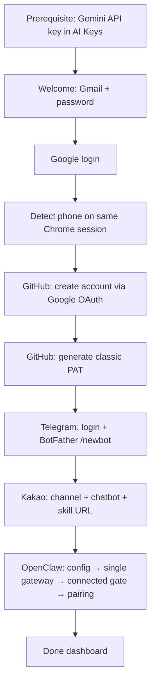

# EG-OpenClaw: Complete Setup Flow

End-to-end documentation for the **Get Started** wizard in EGDesk — from the user entering Gmail credentials through the **Done** dashboard.

**UI:** `src/renderer/components/OpenClaw/OpenClawPage.tsx`  
**Profile name:** `openclaw-default` (constant `PROFILE_NAME`)  
**Chrome profile path:** `{userData}/chrome-profiles/persistent/google/openclaw-default/`

All browser automation steps reuse this **single persistent Chrome profile** so Google, GitHub, Telegram, and Kakao sessions share cookies.

---

## Prerequisites (before Get Started)

These are **not** created by the OpenClaw wizard. They must exist beforehand or Step 6 will fail.

### Gemini API key (required for OpenClaw)

The wizard does **not** ask for or save a Gemini key. The user adds it separately in EGDesk:

| Item | Detail |
|------|--------|
| **Where** | Nav → **AI Keys** (`/ai-keys`) → Add key → provider **Google AI** |
| **Field** | API key (`AIza…`) from [Google AI Studio](https://aistudio.google.com/apikey) |
| **Stored as** | Electron Store `ai-keys[]` — each entry has `providerId: 'google'`, `name`, `isActive`, `fields.apiKey` |
| **When read** | At the start of `openclaw:setup` (Step 6), not during Google/GitHub/Telegram/Kakao steps |

**Resolution order** when OpenClaw handlers load the key (`openclaw-handlers.ts`):

1. Key named **`egdesk`** with `providerId === 'google'`
2. Any **active** Google key (`isActive === true`)
3. Any Google key in the list

If none found → setup aborts immediately:

> *No Gemini API key found. Please add a Google API key in Settings > AI Keys first.*

**How the key is used during Step 6:**

| Use | Detail |
|-----|--------|
| Spawn env | Injected as `GEMINI_API_KEY`, `GOOGLE_API_KEY`, `GOOGLE_GENERATIVE_AI_API_KEY` on every `openclaw` subprocess |
| Onboard | `openclaw onboard --non-interactive … --auth-choice gemini-api-key --gemini-api-key "…"` (step 2) |
| Gateway | Fresh gateway spawn runs with the same env vars so runtime inference works |
| Config | Golden Merge sets `agents.defaults.model.primary` → `google/gemini-3.1-pro-preview` (model id in `openclaw.json`, not the raw API key) |

The raw API key is **not** written into `~/.openclaw/openclaw.json`; it stays in EGDesk’s store and is passed via environment at process spawn time.

### MCP tunnel + Kakao callback key (required for Kakao only)

Auto-generated / managed elsewhere — see Step 5. Not needed for Steps 1–4 or OpenClaw itself.

---

## Wizard steps (UI)

| Step ID | Screen | Trigger |
|---------|--------|---------|
| `welcome` | Email + password form | Initial state |
| `logging-in` | Google login progress | Get Started clicked |
| `creating` | GitHub account creation | After Google login succeeds |
| `token` | GitHub PAT generation | After GitHub account succeeds |
| `telegram` | Telegram Web + BotFather | After token step (always runs) |
| `kakao` | Kakao channel + bot setup | After Telegram (may skip) |
| `installing` | OpenClaw CLI + gateway | After Kakao |
| `done` | Accounts dashboard | Setup complete |

---

## High-level flow



---

## On mount: skip wizard if already set up

Before the user clicks anything, `OpenClawPage` calls `google-profile:list`.

If profile `openclaw-default` already has `githubAccounts.length > 0`, the UI jumps straight to **`done`**, restoring saved state:

- Google email, GitHub accounts/tokens
- Telegram bot tokens
- Kakao search ID, channel URL, bot name

---

## Step 0 — Welcome screen

**User inputs:**
- Google Email
- Password
- **Reuse existing Kakao channel/bot** (default: checked) — used in Kakao step only

**Validation:** both fields required.

**Action:** **Get Started** → `handleGetStarted()`

---

## Step 1 — Google login

**UI:** step → `logging-in`  
**IPC:** `google-profile:login` (`chrome-handlers.ts`)  
**Status events:** `google:status` (opening, filling-email, waiting-2fa, logged-in, …)

### Backend sequence

1. Create/open persistent Chrome profile directory
2. Launch Playwright + stealth Chrome (headful)
3. Navigate to `https://accounts.google.com/`
4. Fill email → Next
5. Handle passkey screen if shown → **Try another way** → **Enter your password**
6. Fill password → Next
7. Handle 2FA method picker if shown → auto-select phone **Yes**
8. Wait up to **5 min** for phone 2FA approval (URL leaves `accounts.google.com`)
   - UI shows **Resend it** button → `google-profile:resend-2fa`
9. Click Chrome **Switch profile?** dialog via CDP (non-fatal if missing)
10. Navigate to `myaccount.google.com/personal-info` on the **same tab** and extract phone (non-fatal)
11. Save to Electron Store `googleProfiles.openclaw-default`:
    - `googleEmail`, `googlePhone` (if found), `profileDir`, timestamps
12. Close browser — **password is never stored**
13. Return `{ success, detectedEmail, phone }` to UI

### Supported login variants

| Variant | Flow |
|---------|------|
| Standard | Email → password → phone notification |
| Passkey first | Email → passkey → try another way → password → phone |
| 2FA picker | Email → password → method list → phone Yes |

### On failure

Returns to `welcome` with error message.

### Phone number (same session)

Phone detection runs **inside step 1** before the browser closes — no second Chrome launch. The UI reads `result.phone` from the login response. If missing, Telegram is skipped later.

`google-profile:get-phone` remains available for debug/standalone use (opens a headless session when the profile already exists but phone was never saved).

---

## Step 2 — GitHub account creation

**UI:** step → `creating`  
**IPC:** `github:create-account`  
**Status events:** `github:status`

**Derived username:** `cleanGmailToUsername(email)` → e.g. `quus.aispace@gmail.com` → `egdesk-quusaispace`

### Backend sequence

1. Open same Chrome profile (headful)
2. Go to `github.com/login`
3. Detect login state (avatar vs login form)
4. If not logged in → click **Continue with Google**
5. Select Google account → confirm permissions → handle **Link account** if shown
   - May auto-read verification code from Gmail
6. **New account path:** fill username, click **Create account**
   - User may need to complete CAPTCHA / email verification manually
7. **Existing account path:** detect username from GitHub profile page
8. Save `githubAccounts[]` to Electron Store
9. Close browser

### On failure

Returns to `welcome`.

### On success

→ `runTokenCreation(resolvedUsername)`

---

## Step 3 — GitHub token generation

**UI:** step → `token`  
**IPC:** `github:create-token`  
**Status events:** `github:status`

Token name: **`egdesk-openclaw`** (classic PAT, 30-day expiry)

### Backend sequence

1. Open Chrome profile → `github.com/settings/tokens`
2. Re-login via Google if needed
3. If `egdesk-openclaw` token already exists and is saved locally → reuse it
4. If token exists on GitHub but not saved → delete and regenerate
5. **Generate new token (classic)** with scopes: `repo`, `workflow`, `write:packages`, `delete:packages`
6. Handle GitHub sudo / confirm access if prompted
7. Save token to Electron Store `githubTokens[username]`
8. Close browser

### On failure

Logs warning — **non-fatal**. Wizard continues to Telegram.

### On success or failure

→ `runTelegramSetup()` (always)

---

## Step 4 — Telegram setup

**UI:** step → `telegram`  
**IPC:** `telegram:setup`  
**Status events:** `telegram:status` (+ desktop notification when awaiting SMS code)

**Requires:** phone number from Step 1b. If missing, skips Telegram but still runs Kakao + OpenClaw.

### Phase A — Telegram Web login

1. Open `web.telegram.org/k/` in Chrome profile
2. Detect state: already logged in / awaiting code / needs phone
3. If needed: **LOG IN BY PHONE NUMBER** → enter country code + local number
   - Strips leading `0` from Korean numbers after country code
4. Wait for user to enter SMS code in browser (up to 5 min, retries on expired code)

### Phase B — BotFather bot creation

1. Navigate to `t.me/BotFather` → START BOT → OPEN IN WEB
2. Click START in chat if first visit
3. Send `/newbot`
4. Bot display name: **`EGDesk OpenClaw`**
5. Bot username: **`egdesk_{sanitized_email_local}_bot`** (e.g. `egdesk_johndoe_bot`)
6. Extract token from BotFather chat (`code.monospace-text`)
7. Fallback if username taken or token missing: `/token` command
8. Save to Electron Store:
   - `telegramBotToken`, `telegramBotTokens[]`, `telegramBotUsername`

### On failure

Logs warning — **non-fatal**. Continues with empty token (OpenClaw may fail pairing later).

### On success or failure

→ `runKakaoSetup()` then `runOpenclawSetup(token)`

---

## Step 5 — KakaoTalk setup

**UI:** step → `kakao`  
**IPC:** `kakao:createChannel`, `kakao:createBot` (`kakao-handlers.ts`)

### Prerequisites (hard gate)

Both must exist or **entire Kakao step is skipped**:

| Requirement | Source |
|-------------|--------|
| Tunnel public URL | `get-mcp-tunnel-config`, live tunnel list, or auto-start |
| `kakaoCallbackApiKey` | Auto-generated UUID in `mcpConfiguration` |

**Tunnel auto-start** (if no URL):
1. Start local MCP HTTP server on port **8080**
2. Reuse stored tunnel name (from Gmail, e.g. `egdesk-quusaispace`) or create new one
3. `mcp-tunnel-start` → `{publicUrl}/kakao/skill`

### Naming

- Channel name: **`EGDesk OpenClaw`**
- Search ID: **`egdesk_{rand}`** (suffix stable on retry)
- Bot name: **`EGClaw Bot {rand}`**

### Phase A — `kakao:createChannel` (Kakao Business)

1. QR login at `accounts.kakao.com` → `business.kakao.com`
2. If `reuseExisting`: scan `business.kakao.com/profiles` for matching `@egdesk_*` channel → skip wizard if found
3. Otherwise: **새 채널 만들기** wizard
   - Basic channel → skip business verification → fill name, IT/IT 일반 category, search ID, upload EGDesk icon
4. Post-wizard: toggle **채널 공개** ON, extract channel URL (`https://pf.kakao.com/...`)

### Phase B — `kakao:createBot` (Chatbot Admin)

Only runs if channel step succeeded and channel was **not** reused (reused channel assumes bot already exists).

1. Login at `chatbot.kakao.com` (QR if needed)
2. Create **카카오톡 채널 기반 챗봇** or reuse existing bot
3. **설정** → link development channel `@egdesk_{rand}`
4. **AI 챗봇 관리** → apply for callback mode (handles 5s timeout limit)
5. Create skill **`openclawresponse`**:
   - URL: `{tunnelUrl}/kakao/skill`
   - Header: `X-Api-Key` = `kakaoCallbackApiKey`
6. Wait for callback approval (up to 10 min, polls every 30s)
7. Enable callback → interim message: `EGClaw가 생각중입니다...`
8. Link skill to **폴백 블록** scenario
9. **배포** (deploy bot)

### Persist on success

```json
{
  "kakaoSetup": true,
  "kakaoSearchId": "egdesk_4521",
  "kakaoChannelUrl": "https://pf.kakao.com/_xxxxx",
  "kakaoBotName": "EGClaw Bot 4521"
}
```

→ `runOpenclawSetup(tokenForOpenClaw)`

---

## Step 6 — OpenClaw setup

**UI:** step → `installing`  
**IPC:** `openclaw:setup` (`openclaw-handlers.ts`)

**Requires:** Gemini API key in **AI Keys** (see Prerequisites — wizard does not configure this)  
**Requires:** Telegram bot token (from store or passed from Step 4)

### Gemini key injection (first thing in `openclaw:setup`)

Before any CLI commands run, the handler reads `ai-keys` from the Electron store and injects the resolved Google key into `cleanEnv`. If missing, the handler returns `{ success: false, error: '…AI Keys first.' }` and the UI logs the failure.

This happens **once per setup run**; it is not re-done during Google login or Kakao setup.

### Backend sequence (steps 0–5: config only, no gateway)

| # | Action |
|---|--------|
| 0 | Start local MCP server `:8080`; start tunnel if configured |
| 1 | `npm install -g openclaw@latest` (skip if already on PATH) |
| 2 | `openclaw onboard --non-interactive` with Gemini API key (initializes base config) |
| 3 | `openclaw doctor --fix` |
| 4 | `openclaw plugins install --force` bundled Kakao plugin + `npm install --production` in `~/.openclaw/extensions/kakao` |
| 5 | **Golden Merge** → write final `~/.openclaw/openclaw.json` (Telegram token, Kakao config, Gemini model, MCP server, disable bonjour) |

**Prerequisite fix for step 5:** Golden Merge must be **finalized before any gateway runs**. Config changes require a gateway restart, so the gateway must never start against a pre-merge config. Do **not** run a second `onboard --install-daemon` or re-apply merge after the gateway has already seen an older file — that pattern causes stale config and duplicate pollers.

---

### Step 6 — ensure a single gateway (tear down duplicates)

Remove `onboard --install-daemon` + `gateway install` from the setup path. Before starting the one gateway EGDesk owns, tear down any pre-existing service so it cannot co-poll the bot token (→ HTTP 409, `/start` never arrives):

```bash
openclaw gateway stop       2>/dev/null || true
openclaw gateway uninstall  2>/dev/null || true
openclaw gateway status --deep   # inspect; expect no other running gateway
openclaw doctor --deep           # warns on extra launchd/systemd/schtasks gateways
```

Also run `killGateway()` (pkill/taskkill) to catch orphaned processes a plain `gateway stop` misses.

**One poller, period.** A system-level or duplicate install that survives `gateway stop` will steal Telegram `getUpdates` and break pairing.

---

### Step 7 — spawn one gateway, gate on Telegram `connected`

Start a **single** foreground gateway process EGDesk owns — do not run both a managed daemon and a spawned process:

```bash
openclaw gateway run &    # or: openclaw gateway --force (spawn equivalent)
```

**Readiness gate:** `Gateway reachable` is **not** enough. Poll until the Telegram **channel** reports `connected` — that reflects the live poller state, so `/start` is only safe once updates are actually being consumed:

```bash
echo "Waiting for Telegram channel to connect..."
for i in $(seq 1 30); do               # ~60s budget
  if openclaw channels status --channel telegram --json 2>/dev/null \
       | jq -e '.. | objects | select(.connected == true)' >/dev/null 2>&1; then
    echo "Telegram channel connected."
    break
  fi
  if [ "$i" -eq 30 ]; then
    echo "ERROR: Telegram never reached connected. Check logs:"
    openclaw channels logs --channel telegram --lines 50
    exit 1
  fi
  sleep 2
done
```

If Telegram never reaches `connected`, do **not** proceed to pairing — `/start` will silently fail or hit `created:false`.

---

### Step 8 — Telegram pairing (only after step 7 gate passes)

Human/automation sends `/start` to the bot in Telegram Web **after** the channel is `connected`.

Poll the **CLI** for the pairing code — not the chat UI. This handles both a freshly created request and a pre-existing pending one (avoids the silent `created:false` trap):

```bash
CODE=""
for i in $(seq 1 30); do
  CODE=$(openclaw pairing list telegram --json 2>/dev/null \
           | jq -r '.requests[0].code // empty')
  [ -n "$CODE" ] && break
  sleep 2
done

if [ -z "$CODE" ]; then
  echo "ERROR: no pairing code. Either /start wasn't received, or a stale"
  echo "entry is blocking creation. Inspect: openclaw pairing list telegram"
  exit 1
fi
```

Browser chat scraping is a fallback only; primary source is `pairing list --json`.

---

### Step 9 — approve pairing

```bash
openclaw pairing approve telegram "$CODE"
```

---

### Step 10 — verify

```bash
openclaw channels status
```

---

### Three fixes this model addresses

| # | Problem | Fix |
|---|---------|-----|
| 1 | **409 / stolen `/start`** | Tear down service gateway + uninstall before `gateway run`; one `getUpdates` consumer only |
| 2 | **Pairing before channel ready** | Gate on `channels status --channel telegram --json` → `connected`, not gateway reachability |
| 3 | **Silent `created:false`** | Read code from `pairing list --json`, approve existing pending request instead of waiting for chat |

---

### Managed-daemon alternative

If EGDesk should not babysit a foreground process:

- Keep `openclaw gateway install`
- Replace `gateway run &` with `openclaw gateway restart`
- Drop `GW_PID` handling
- **Readiness poll and pairing logic stay identical**

Do **not** do both managed daemon and spawned gateway — that is what causes duplicate pollers.

---

### JSON shape (verified openclaw 2026.4.24)

- `openclaw pairing list telegram --json` → `{ channel, requests: [{ code }] }`
- `openclaw channels status --json` → `channelAccounts.telegram[0].connected === true` when the Telegram poller is connected

EGDesk parses these fields in `openclaw-handlers.ts` (`fetchTelegramPairingCode`, `parseTelegramConnectedFromStatusJson`).

---

### Golden Merge config highlights

```json
{
  "gateway": { "mode": "local" },
  "agents": { "defaults": { "model": { "primary": "google/gemini-3.1-pro-preview" } } },
  "channels": {
    "telegram": { "enabled": true, "botToken": "..." },
    "kakao": { "enabled": true, "webhookPath": "/kakao/skill", "useCallback": true, "dmPolicy": "open" }
  },
  "mcp": { "servers": { "egdesk": { "type": "http", "url": "http://localhost:8080/mcp" } } }
}
```

### On success or failure

UI step → **`done`** (OpenClaw failures are logged as warnings, not fatal to reaching done).

---

## Step 7 — Done dashboard

Shows:
- Created accounts (Google, GitHub, Telegram bot, Kakao channel)
- Gateway / Telegram connection status (polled every 10s)
- Tunnel URL + skill endpoint `{tunnelUrl}/kakao/skill`
- Retry buttons: Kakao setup, OpenClaw setup, Telegram pairing
- Debug panel for individual OpenClaw setup steps

---

## Runtime architecture (Kakao messages)

After setup, Kakao skill requests hit the tunnel → local server `:8080` → OpenClaw gateway `:18789`:

```
Kakao servers → {tunnelUrl}/kakao/skill → localhost:8080
  → immediate "type ㅇ for answer" to user
  → background POST to localhost:18789/kakao/skill (OpenClaw + Gemini)
  → answer stored; user types ㅇ to retrieve
```

---

## What persists where

| Location | Contents |
|----------|----------|
| `{userData}/chrome-profiles/.../openclaw-default/` | Chrome cookies/sessions for all services |
| Electron Store `googleProfiles.openclaw-default` | Email, phone, GitHub accounts/tokens, Telegram tokens, Kakao IDs |
| Electron Store `ai-keys[]` | **Gemini / Google AI API key** (prerequisite; used by OpenClaw at spawn time) |
| `~/.openclaw/openclaw.json` | OpenClaw gateway config (model id, channels — not the raw API key) |
| `~/.openclaw/extensions/kakao/` | Installed Kakao plugin |
| Electron Store `mcpConfiguration` | Tunnel URL, server name, `kakaoCallbackApiKey` |

---

## Skip / failure summary

| Condition | Effect |
|-----------|--------|
| **No Gemini API key in AI Keys** | OpenClaw setup fails immediately (before CLI install) |
| Google login fails | Stops at welcome |
| GitHub account fails | Stops at welcome |
| GitHub token fails | Warning → continues |
| No Google phone | Skips Telegram → continues |
| Telegram fails | Warning → continues (OpenClaw pairing may fail) |
| No tunnel URL or Kakao API key | Skips Kakao → continues |
| Kakao fails | Warning → continues |
| No Telegram bot token | OpenClaw setup fails with error |
| Duplicate gateway pollers (409) | `/start` never creates pairing code — tear down service gateway first |
| Telegram channel not `connected` before `/start` | Pairing silently fails — wait on channel status, not gateway reachability |

Most steps after GitHub account creation are **best-effort** — the wizard tries to reach `done` even when intermediate steps partially fail.

---

## IPC reference

| IPC | Step |
|-----|------|
| `google-profile:login` | Google login + phone detection (same session) |
| `google-profile:get-phone` | Standalone phone re-fetch (debug / retry) |
| `google-profile:resend-2fa` | Resend 2FA during login |
| `github:create-account` | GitHub signup |
| `github:create-token` | GitHub PAT |
| `telegram:setup` | Telegram + BotFather |
| `kakao:createChannel` | Kakao Business channel |
| `kakao:createBot` | Kakao chatbot + skill |
| `openclaw:setup` | Full OpenClaw install + pairing |
| `openclaw:pair` | Retry Telegram pairing only |
| `openclaw:status` | Gateway / channel status |
| `get-mcp-tunnel-config` | Tunnel + Kakao API key |
| `mcp-tunnel-start` | Start public tunnel |
| `https-server-start` | Start local MCP server |

---

## Source files

| Area | File |
|------|------|
| Wizard UI | `src/renderer/components/OpenClaw/OpenClawPage.tsx` |
| **Gemini key UI (prerequisite)** | `src/renderer/components/AIKeysManager/` → route `/ai-keys` |
| Google / GitHub / Telegram handlers | `src/main/chrome-handlers.ts` |
| Kakao handlers | `src/main/kakao-handlers.ts` |
| OpenClaw handlers | `src/main/openclaw-handlers.ts` |
| Preload bridge | `src/main/preload.ts` → `electron.debug.*` |
| Kakao plugin source | `packages/openclaw-kakao-plugin/` |
| Kakao skill proxy | `src/main/mcp/server-creator/local-server-manager.ts` |
