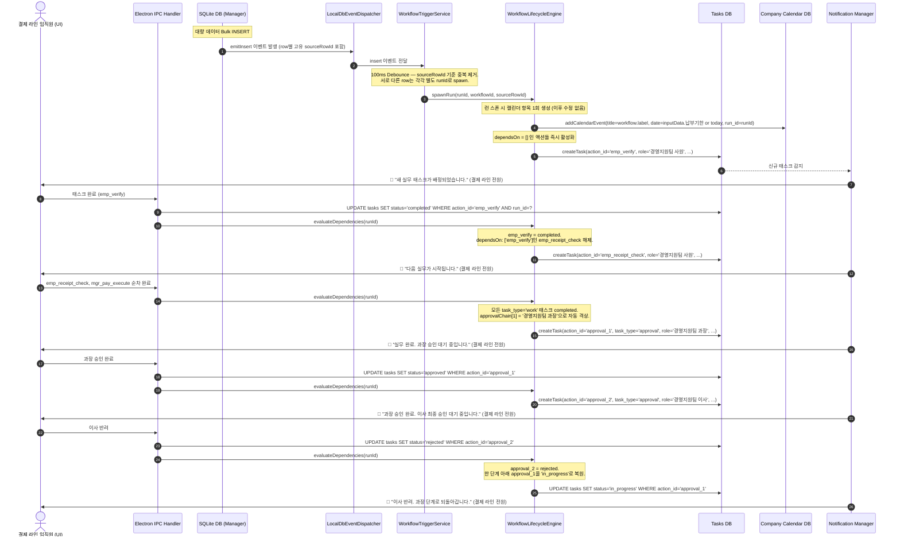

# EGDesk 이벤트 감지 및 워크플로 실행 라이프사이클 (Workflow Runtime Lifecycle) 아키텍처 설계

기존 EGDesk의 AI Center, 워크플로 명세 및 런타임 저장소(`WorkflowDbManager`), 그리고 내장 MCP 도구들을 긴밀히 연결하기 위한 **이벤트 감지 및 워크플로 실행 엔진(Event Detection & Workflow Execution Engine)**의 최종 아키텍처 설계서입니다.

---

## 핵심 도메인 이중 분리 원칙

**Company Calendar (회사 캘린더)** — 전사 공유 비즈니스 마일스톤과 데드라인을 시각화하는 인간용 뷰. 워크플로 런 스폰 시 1회 생성되며 이후 엔진이 수정하지 않습니다. 엔진은 캘린더를 읽지 않으며, 캘린더는 상태(status)를 갖지 않습니다.

**Tasks (태스크)** — 실무자가 오늘 처리해야 할 물리적 업무 이력. 엔진이 읽고 쓰는 유일한 실행 데이터. `dependsOn` 해소, 승인 체인 격상, 반려 롤백 — 모든 엔진 로직은 오직 `tasks` 테이블을 기준으로 작동합니다.

워크플로 실행 순서는 `stages` 없이 **`dependsOn` DAG만으로 완전히 표현**됩니다. 승인 격상 타이밍은 해당 런의 모든 실무 태스크(`task_type='work'`)가 `completed`가 되는 시점입니다.

---

## 1. 런타임 라이프사이클 (End-to-End Sequence)



---

## 2. 이중 저장소 설계

### 2.1. Tasks 테이블 — 엔진 실행의 단일 진실 공급원

```sql
CREATE TABLE IF NOT EXISTS tasks (
    id          TEXT PRIMARY KEY,
    action_id   TEXT NOT NULL,          -- 워크플로 명세의 action.id와 1:1 매핑
    run_id      TEXT NOT NULL,
    title       TEXT NOT NULL,
    role        TEXT NOT NULL,
    task_type   TEXT NOT NULL DEFAULT 'work',  -- 'work' | 'approval'
    status      TEXT NOT NULL DEFAULT 'pending',
                                        -- 'pending' | 'in_progress' | 'completed'
                                        -- | 'approved' | 'rejected' | 'cancelled'
    created_at  DATETIME DEFAULT CURRENT_TIMESTAMP,
    updated_at  DATETIME DEFAULT CURRENT_TIMESTAMP
);

CREATE INDEX IF NOT EXISTS idx_tasks_run_id    ON tasks(run_id);
CREATE INDEX IF NOT EXISTS idx_tasks_action_id ON tasks(action_id, run_id);
CREATE INDEX IF NOT EXISTS idx_tasks_role      ON tasks(role);
CREATE INDEX IF NOT EXISTS idx_tasks_status    ON tasks(status);
```

**설계 원칙:**
- `action_id`는 워크플로 명세의 `actions[].id`와 정확히 대응합니다. `dependsOn` 해소 시 ID 기반 조회를 보장하며 문자열 매칭에 의존하지 않습니다.
- 승인 태스크(`task_type='approval'`)의 `action_id`는 엔진이 자동 생성합니다 (예: `approval_0`, `approval_1`, `approval_2`).
- `approved` / `rejected` 상태는 승인 태스크 전용입니다. 실무 태스크는 `completed`만 사용합니다.

### 2.2. Company Calendar 테이블 — 인간용 데드라인 뷰

캘린더 항목은 워크플로 런을 대표합니다. 특정 태스크나 역할이 아닌 비즈니스 이벤트 전체를 나타냅니다.

```sql
CREATE TABLE IF NOT EXISTS company_calendar (
    id          TEXT PRIMARY KEY,
    title       TEXT NOT NULL,
    description TEXT,
    date        TEXT NOT NULL,          -- 데이터 입력일 또는 AI가 추출한 마감일
    run_id      TEXT,                   -- 참고용. 엔진 로직에 사용 안 함.
    created_at  DATETIME DEFAULT CURRENT_TIMESTAMP
);

CREATE INDEX IF NOT EXISTS idx_cal_date   ON company_calendar(date);
CREATE INDEX IF NOT EXISTS idx_cal_run_id ON company_calendar(run_id);
```

**설계 원칙:**
- `status` 컬럼 없음. 캘린더 항목은 삭제되거나 그대로 남을 뿐입니다.
- `assignee_role` 없음. 캘린더는 워크플로 전체를 대표하며 특정 담당자에 귀속되지 않습니다.
- `date`는 `inputData`에 마감일 관련 필드가 있으면 AI가 추출하여 설정. 없으면 `CURRENT_DATE`.
- `run_id`는 관리자 참고용이며 엔진 분기 조건에 사용하지 않습니다.
- 엔진은 `spawnRun()` 시 1회만 캘린더에 씁니다. 이후 승인 격상, 반려 롤백, 태스크 완료 등 어떤 상태 변이도 캘린더를 수정하지 않습니다.

---

## 3. evaluateDependencies 엔진 로직

태스크 완료 또는 승인 상태 변이가 발생할 때마다 호출됩니다. 단일 함수가 실무 DAG 해소와 승인 격상을 모두 담당합니다.

```
evaluateDependencies(runId):

  1. [실무 DAG 해소]
     tasks 테이블에서 runId의 모든 completed action_id를 수집.
     워크플로 명세의 actions[]를 순회하여:
       - 아직 tasks에 존재하지 않고
       - dependsOn의 모든 항목이 completed인 액션
     → 즉시 createTask()로 활성화.

  2. [승인 격상 조건 확인]
     runId의 모든 task_type='work' 태스크가 completed인지 확인.
     아직 아니라면 종료.

  3. [현재 승인 위치 추론]
     task_type='approval' 태스크 중 approved 상태인 것의 최대 인덱스 N 확인.
     approval_(N+1)이 아직 없으면 → createTask(action_id='approval_(N+1)', ...).
     approval_(N+1)이 pending 또는 in_progress면 → 대기.
     approval_(N+1)이 rejected면 → 롤백 처리 (4항 참조).

  4. [반려 롤백]
     rejected된 approval_K 감지 시:
       approval_(K-1)을 'in_progress'로 UPDATE.
       K-1 = 0 (기안자 단계)이면 해당 기안자의 실무 태스크들도 'in_progress'로 복원.
       이 상태에서 탈출 경로는 없음. 루프는 시스템 관리자의 런 삭제로만 종료됨.

  5. [최종 완료]
     approvalChain 최상단의 승인 태스크가 approved → 워크플로 런 status = 'completed'.
```

---

## 4. 승인 체인 동작 규칙

### 4.1. 현재 승인 위치 추론

커서 필드 없이 `tasks` 상태 스캔만으로 현재 위치를 추론합니다.

```
approvalChain = ["경영지원팀 사원", "경영지원팀 과장", "경영지원팀 이사"]
                  index 0 (기안자)    index 1              index 2

판별 규칙:
- approved 승인 태스크 없음          → 실무 진행 중 (격상 전)
- approval_1 = approved              → 현재 이사(index 2) 단계
- approval_1 = approved,
  approval_2 = rejected              → 과장(index 1)으로 롤백
```

### 4.2. 반려 시 한 단계 롤백

반려는 항상 정확히 한 단계 아래로만 내려갑니다.

```
approval_2(이사) rejected  → approval_1(과장) in_progress로 복원
approval_1(과장) rejected  → approval_0(사원) in_progress로 복원
                              + 사원의 실무 태스크들도 in_progress로 복원
```

`approvalChain[0]` 단계에서 반려가 반복되면 엔진은 루프를 스스로 종료하지 않습니다. 해당 런은 시스템 관리자가 직접 삭제하는 것 외에 탈출 경로가 없습니다.

### 4.3. 최종 완료 및 전체 취소

- **최종 완료**: 최상단 승인 태스크 `approved` → 워크플로 런 status = `completed`.
- **전체 취소**: 시스템 관리자에 의한 런 삭제 시 워크플로 런 status = `cancelled`. 결제 라인 전원에게 취소 푸시 발송.

---

## 5. 디바운스 및 멀티-런 스폰 규칙

```typescript
const pendingRows = new Map<string, RowInsertEvent>(); // key: sourceRowId

onInsertEvent(event: RowInsertEvent) {
  pendingRows.set(event.sourceRowId, event); // 동일 row 중복 제거
  debounce(() => {
    for (const [, row] of pendingRows) {
      engine.spawnRun(row); // row별 독립 runId 생성
    }
    pendingRows.clear();
  }, 100);
}
```

두 건의 과태료가 동시에 입력되어도 각각 독립 워크플로 런으로 처리됩니다.

---

## 6. 알림 설계

알림 트리거는 **태스크 상태 변이**입니다. 캘린더 INSERT는 알림을 발생시키지 않습니다.

수신자는 워크플로 명세에서 자동 산출됩니다:

```
수신자 = Set(actions[].role) ∪ Set(approvalChain)
```

```typescript
export class NotificationManager {
  public async handleTaskEvent(taskId: string, message: string): Promise<void> {
    const task = userDataDb.prepare('SELECT * FROM tasks WHERE id = ?').get(taskId);
    if (!task?.run_id) return;

    const workflow = workflowDb.getWorkflow(run.workflowId);

    const recipientSet = new Set<string>();
    workflow.approvalChain?.forEach((r: string) => recipientSet.add(r));
    workflow.actions?.forEach((act: any) => {
      if (act.role) recipientSet.add(act.role);
    });

    for (const role of recipientSet) {
      await this.sendPushNotification({ recipientRole: role, body: message, runId: task.run_id });
    }
  }
}
```

---

## 7. 워크플로 명세 (Workflow Schema)

### 7.1. 최상위 구조

```json
{
  "inputs": ["field1", "field2"],
  "triggerTable": "테이블이름",
  "approvalChain": ["roleA", "roleB", "roleC"],
  "actions": [...]
}
```

- **`inputs`**: 워크플로 기동 시 필수 입력 필드 목록.
- **`triggerTable`**: 신규 행 삽입 시 이 워크플로를 기동시킬 테이블명.
- **`approvalChain`**: 최초 기안 실무 역할(index 0)부터 최상위 결재자까지의 수직 승인선. 반려 시 항상 한 단계 아래로만 롤백.
- **`actions`**: 실행할 액션의 평탄한(flat) 리스트. 순서는 `dependsOn`이 결정합니다.

### 7.2. 액션 타입

`create_task`:
```json
{
  "id": "emp_verify",
  "type": "create_task",
  "title": "운행기록 대조 및 실사용자 확인",
  "role": "경영지원팀 사원",
  "dependsOn": []
}
```

`update_status`:
```json
{ "type": "update_status", "value": "정상진행중" }
```
워크플로 런의 status를 갱신합니다. 태스크를 생성하지 않으며 DAG 완료 조건 판별에 포함되지 않습니다.

### 7.3. 런타임 참조 모델

```json
{
  "workflowId": "...",
  "inputData": { "차량번호": "12가3456", "과태료_금액": 80000, "납부기한": "2026-06-30" },
  "sourceTable": "법인차량 과태료",
  "sourceRowId": "row-uuid"
}
```

---

## 8. MCP 배포 예시

```json
{
  "name": "ai_center_create_workflow",
  "args": {
    "inputs": ["차량번호", "위반내용", "과태료_금액", "납부기한"],
    "triggerTable": "법인차량 과태료",
    "approvalChain": ["경영지원팀 사원", "경영지원팀 과장", "경영지원팀 이사"],
    "actions": [
      {
        "id": "emp_verify",
        "type": "create_task",
        "title": "운행기록 대조 및 실사용자 확인",
        "role": "경영지원팀 사원",
        "dependsOn": []
      },
      {
        "id": "emp_receipt_check",
        "type": "create_task",
        "title": "영수증 증빙 확인 및 적격성 대조",
        "role": "경영지원팀 사원",
        "dependsOn": ["emp_verify"]
      },
      {
        "id": "mgr_pay_execute",
        "type": "create_task",
        "title": "과태료 납부 처리 및 송금",
        "role": "경영지원팀 과장",
        "dependsOn": ["emp_receipt_check"]
      },
      {
        "type": "update_status",
        "value": "정상진행중"
      }
    ]
  }
}
```

---

## 9. 결론

캘린더는 워크플로 런을 대표하는 단일 항목으로, 런 스폰 시 1회 생성됩니다. 특정 태스크나 담당자에 귀속되지 않으며 이후 엔진이 수정하지 않습니다.

`tasks`는 엔진의 단일 진실 공급원입니다. `dependsOn` DAG 해소, 승인 격상, 반려 롤백 — 모든 엔진 판단이 여기서만 이루어집니다. `stages` 없이 평탄한 `actions` 배열과 DAG만으로 임의의 복잡한 실행 순서를 표현할 수 있습니다.

`approvalChain[0]` 단계의 반려 루프는 엔진이 스스로 종료하지 않습니다. 이는 의도된 동작이며, 시스템 관리자의 개입으로만 해소됩니다.